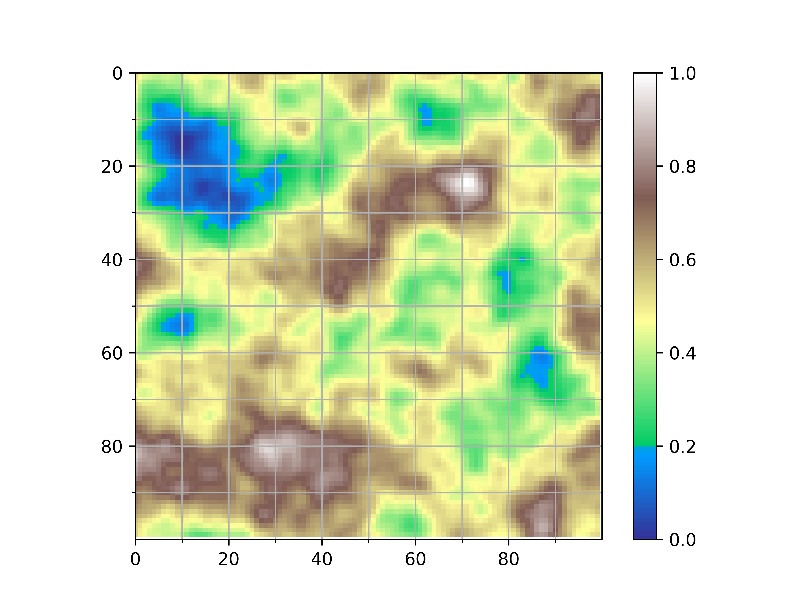
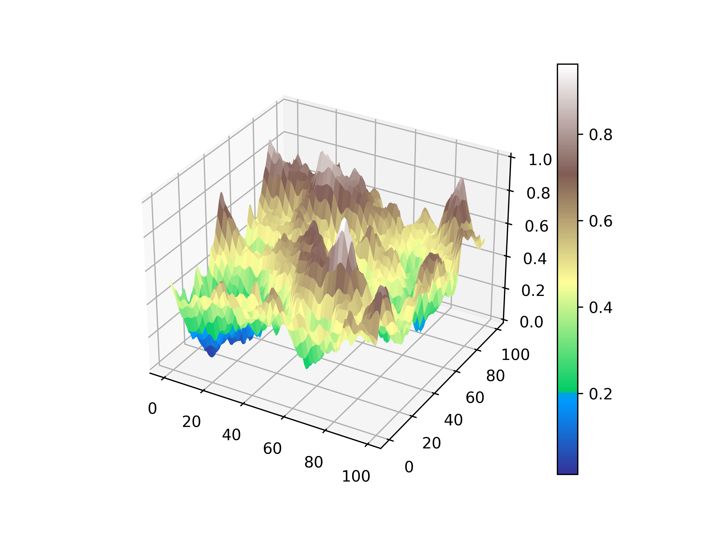
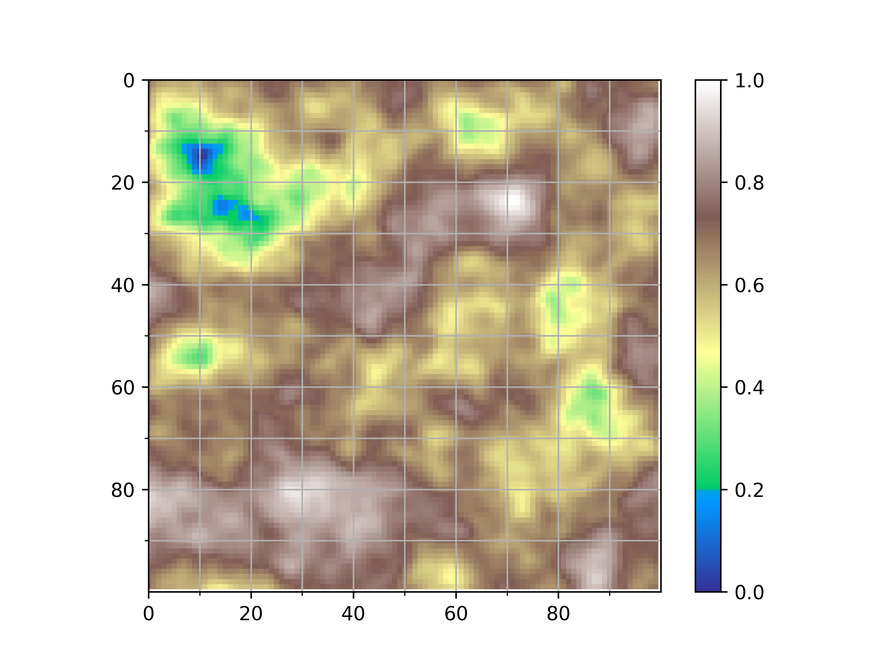
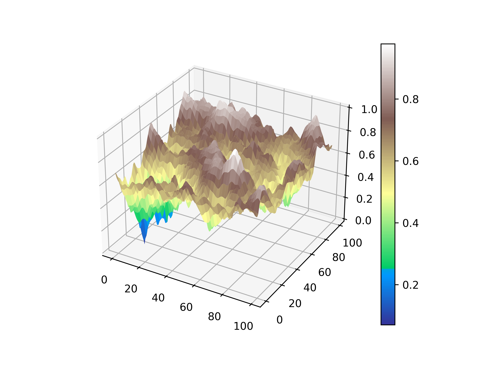
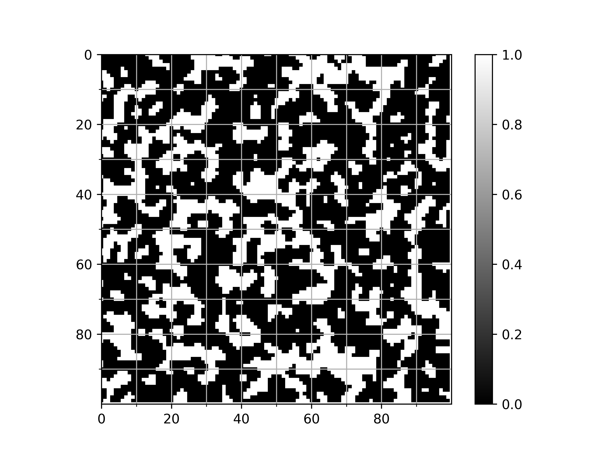
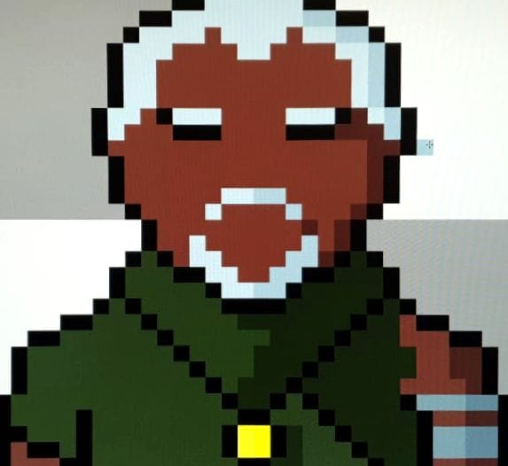
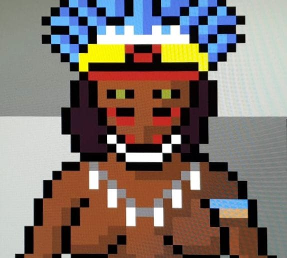
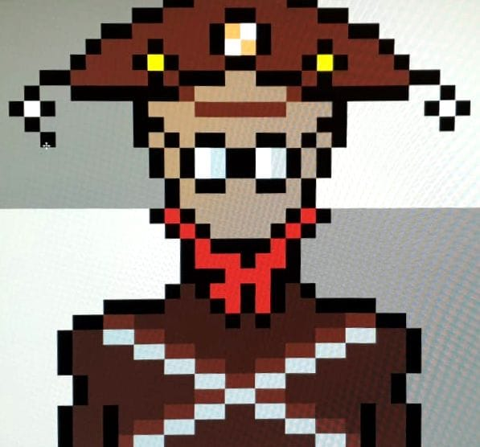

# cyber-jirimoon
A cyberpunk RPG system about a glitch in time and space, mixing a lot of cultures that are not usually explored in 
mainstream video games. 
More than a game, this is an opportunity to apply algorithms I've always wanted and did not have a good dataset to play 
with.

---

## What is implemented so far?
Not much. If you want a glimpse of usage, you may refer to the `./tests` folder. 
Within the maps class you will find a few methods to generate and transform world maps and dungeons.

1. World Maps 

World maps can be generated to have more or less water, islands and altitude, but so far it relies on a custom
colormap to visualize such places. Once the map is created, you can play around with those parameters.

2. Dungeons
   
The dungeons use the same Map class, but without `zoom=True` variable being set. This generates a bunch of perlin
noise. Thus, I scale the map and pass through a hyperbolic tangent function, then use a value mask so everything will
either be ground or a wall. So far this is the result:
   

### Libraries
If you don't already have it installed, you may need:

1. matplotlib
2. numpy
3. perlin-noise

---

### A little bit of the game's history
> "During the decade of 2020s a massive event occurred in the universe and had unified different worlds by a single 
> entrance. It is not known or understood how the transportation of matter happens, but it has been proven the 
> existence of several portals that allow transit between the worlds."
> 
 &ndash; "The History of the Cataclysm", Франциско Иванович

After the pandemic exposure of mankind to a highly contagious virus, most of our everyday life was shifted towards a 
social distancing style. Schools and universities decided to allow online classes, non-essential workers were allowed to
work from home and the majority of interactions between humans started to take place in the virtual world. This 
situation contributed to a huge gap in every government economy, since several presence-based commercial activities had 
to be adapted until they ended. In the following months an unbelievable number of welfare programs emerged to take care
of those who could not work or provide for themselves during these trying times. Nevertheless, the world was not ready 
for such magnitude of events and soon the health crysis turned itself into an economic crisis.

The virus itself, despite being present, soon stopped being the main problem mankind was facing. Hospitals, in effort
to provide for the population, started programs for virtual schedules and doctor appointments were fully digital. 
At first, people had to leave their houses only if some kind of medication were needed, but soon companies started 
improving the existing drones to take care of pretty much every delivery and small cargo transportation one would need.
This evolved very quickly, as local companies started to appear and introduce their own tweaks to drones and charge 
accordingly to the service provided. What was first used as an essential tool for medicine and food transportation 
became a big network for commerce, legal and illegal. Since drone services were fully automated within a few months, 
it was impractical to check every package that was being transported, even the most advanced algorithms at the time 
could not function within a reasonable range of accuracy based purely on location and package dimension tracking. 
Welfare programs were not working flawlessly and due to many activities started to accept machine automation, a lot of 
the population started facing money problems and during the first half of the decade the world was presented to a huge 
increase in new companies created by people who did not have enough currency, but a lot of time in their hands, 
the *CompBoom*. Due to low human traffic on the streets, the crime shifted towards small digital scams, which happened in 
big numbers, and a few fancy heists towards essential feedstock warehouses. Physical currency was not the goal of any 
scam anymore, most payments were already done online and there were plenty of frameworks that allowed that, so during 
the *CompBoom* many digital currencies, digital banks and payment methods arised, which has heavily affected the already 
weakened economy of most states. Teams of trained police corp started to be cut down to numbers only needed to deal with
ongoing crime rates, leading many tactical trained personnel to face themselves struggling to make ends meet. Soon, 
militia groups, mercenaries and mafia-like structures started emerging throughout the globe and when the state realized 
what was going on it was too late, both to hire their teams back and stop these movements from happening.  

The later half of the decade was marked by the discovery of permanent immunity to the virus, followed by the mutation
into a new strain, the endless quarantine that seemed to be over came back full throttle, but this time most of the 
framework needed to deal with the situation was already there, and to be honest people were started to get used to this 
new lifestyle. A new type of digital gathering became popular, people would meet in virtual rooms to do all kinds of 
things, not just classes were virtual, but shows, conferences and pretty much any type of social event started happening
this way. It was close to the end of february 2028 when a group of scientists were gathered to perform a group 
experience around the world, aiming to deploy a set of satellites and provide a more robust type of internet that could
deal with the higher flux of connections and information flow. The deployment was straightforward, a small number of 
satellites were supposed to be launched into orbit at the same time, while following a predetermined trajectory, most of
it was already automated and the scientists were only required to be there in case something extraordinary would happen 
outside the capabilities of the algorithms. Since the circumstances of the world required a small number of people to 
work in presencial tasks, maintenance became a burden to face, very intricate and complex activities could not be 
performed by robots and drones so easily and controlling them started to require specialized training. To avoid the 
frequent maintenance many devices required, a lot of research started to be funded on alternative sources of energy, 
the most promising one was nuclear power and since satellites and space offered a biological free environment, most of 
the new satellites had this technology implemented to accomplish the last step of development and testing of the 
devices. A highly precise, almost choreographed, launch was done and each satellite reached its destiny in time and 
without any damage or issue, they were 112 in total. The network worked flawlessly for over a year, the transition from
the old network happened very quickly, only a few equipment operated relying on the previous network. At the end of 2029
there was a burst of high energy rays from somewhere in space and this is where it all started.
 

A malfunction caused by the energy burst caused seven of the satellites to lose communication, but before we could 
come up with a plan for fixing the communication and take back control of the satellites, they started to fall from 
orbit. It was a slow fall and very predictable, so evacuation plans could be performed to free space where they were 
supposed to hit the surface. Three of them fell in the water, one in the atlantic ocean, one in the indian ocean and the
other close to Japan. The remaining four hit the surface in land: Brazil, Egypt, a disputed territory close to the 
border of Russian, Kazakhstan, Mongolia and China, and the last one in the outbacks of Australia. For the ones that fell
into land, teams of automated and controlled robots and a few humans were sent to rescue the remains, but some weird 
events started to happen around the sites, which for the first time in almost 10 years lead the assembly of a team to 
gather around the sites. The network kept running, but the burst caused something in the satellites that more frequently
than expected and started to get the network offline from time to time, thus robots were not 100% reliable for the task,
since they needed to be operated.
 

### Concept Art
The first thing to be noted is: I am not an artist :) 
 
 
 